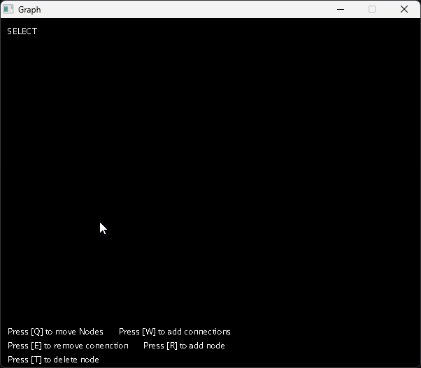
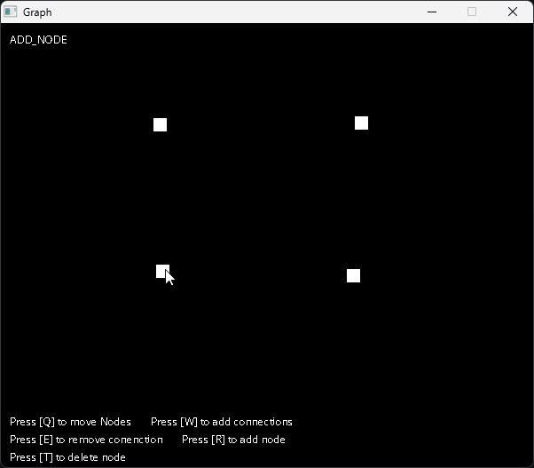
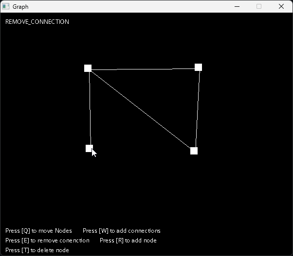
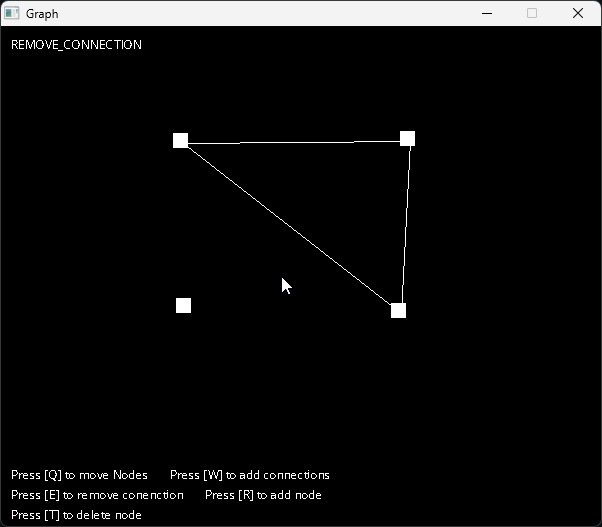

# Graph Visualizer 

A program created to visualize graphs. Used SDL2 2.0.16 with C/C++

## Description

This project was built with the Simple DirectMedia Layer (SDL) Library, version 2.0.16. This project is a demonstration of the capabilities of what can be done using the SDL library, and a basic demonstration of the concepts in [Graph Theory](https://en.wikipedia.org/wiki/Graph_theory). Some basic demonstrations in you can do using this project:

### Creating Nodes

  Create nodes by pressing `r` on your keyboard then clicking an empty space.
<div align="center">

  

  _adding nodes_

</div>

### Connecting Nodes / Creating Endges

Connect nodes by pressing `w` on your keyboard then selecting an initial node by clicking, and selecting a secondary node.
<div align="center">

  

  _creating edges_

</div>

### Deleting Nodes & Edges

Remove nodes and edges by pressing `e` and `t`.
<div align="center">
    
    </br>
    _deleting edges_
    </br>
    </br></br>
    
    </br>
    _deleting nodes_
</div>

## Getting Started

### Dependencies

The following dependencies are what was used during development:

* OS: Windows 10/11
* Compiler: GCC 14.2 (i686_posix release; see releases [here](https://github.com/niXman/mingw-builds-binaries/releases))
* Library: 
    - SDL2 2.0 
    - SDL2 ttf

_\* see the official [SDL2 Release logs](https://github.com/libsdl-org/SDL/releases) for updated versions of the library and dependencies, for old versions of SDL TTF here is the [official source](https://www.libsdl.org/projects/SDL_ttf/release/)._

\* I have included a basic font in ths repository in `src/Fonts`.

### Executing program

1. Assuming you have installed all necessary libraries and compilers, run:
```
> make
```


## Author

* [@AloysiusButac](https://github.com/AloysiusButac) (email: aloysiusbutac@gmail.com)


<!-- ## License -->

<!-- This project is licensed under the [NAME HERE] License - see the LICENSE.md file for details -->

<!-- ## Acknowledgments -->

<!-- Inspiration, code snippets, etc. -->
<!-- * [awesome-readme](https://github.com/matiassingers/awesome-readme)
* [PurpleBooth](https://gist.github.com/PurpleBooth/109311bb0361f32d87a2)
* [dbader](https://github.com/dbader/readme-template)
* [zenorocha](https://gist.github.com/zenorocha/4526327)
* [fvcproductions](https://gist.github.com/fvcproductions/1bfc2d4aecb01a834b46) -->